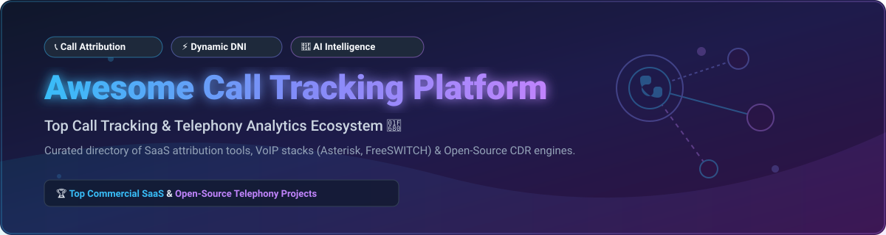

# Awesome Call Tracking Platform 📞

  
  
  
  

## 📌 Top Call Tracking Platforms & Telephony Ecosystem 🚀

**Curated List of SaaS Products, Conversation Intelligence Tools & Open-Source Telephony Engine Projects**

*Focused on Marketing Call Attribution, Dynamic Number Insertion (DNI), Call Analytics, Conversation Intelligence & Lead Source Tracking* 📊

**Last updated: September 2026**

---

This repository tracks notable **SaaS platforms** 💼 and **open-source projects** 🔓 for **Call Tracking**. These systems attribute phone calls to digital marketing sources, provide dynamic number insertion (DNI), record and analyze speech with AI, and connect call conversion data to CRM and advertising platforms like Google Ads and HubSpot.

**Open-source emphasis**: Purpose-built marketing call tracking with DNI, attribution, and speech analytics is predominantly commercial. Open options focus on telephony engines (**Asterisk**, **FreeSWITCH**, **Fonoster**), CDR analytics (**CDR-Stats**), and custom programmable voice builds on top of open VoIP stacks.

---

## 📑 Table of Contents

- [🏢 Market Overview](#-market-overview)
- [💼 SaaS / Hosted Call Tracking Platforms](#-saas--hosted-call-tracking-platforms)
- [🔓 Open-Source GitHub Projects](#-open-source-github-projects)
- [🤝 How to Contribute](#-how-to-contribute)
- [💖 Support & Sponsorship](#-support--sponsorship)
- [📈 Star History](#-star-history)
- [⚠️ Disclaimer](#%EF%B8%8F-disclaimer)

---

## 🏢 Market Overview

> 💡 **Market Size & Fragmentation:** The global Call Tracking & Conversation Intelligence market is estimated at **~$3.2 Billion USD in 2026** (growing at ~13.5% CAGR). The market is **moderately fragmented**: Enterprise attribution & AI conversation intelligence are led by scale players like *Invoca* and *CallRail*, while specialised segments (pay-per-call, performance marketing, local SMBs) sustain a wide ecosystem of competitive vendors.

---

## 💼 SaaS / Hosted Call Tracking Platforms

Below is a curated comparison of top commercial call tracking and conversation intelligence SaaS providers, sorted by estimated company scale (valuation/revenue descending).

| SaaS Product 🏢 | Company Scale / Revenue 📊 | Starting Price 💵 | Free Tier / Trial Limit 🎁 | Key Features & Focus 🎯 |
| :--- | :--- | :--- | :--- | :--- |
| **[Invoca](https://www.invoca.com/)** | **$1.1 Billion Valuation** ($100M+ ARR) | Custom Quote (~$1,000+/mo base) | No self-serve free plan (14–30 day proof-of-concept trial via enterprise sales demo) | Enterprise AI conversation analytics, contact center optimization, and digital ad attribution at scale. |
| **[CallRail](https://www.callrail.com/)** | **$300M+ Valuation** ($75M+ ARR) | $50 / month | **14-day free trial** (Full access, no credit card required) | Market-leading SMB/mid-market call attribution, Dynamic Number Insertion (DNI), form tracking & AI call summaries. |
| **[Marchex](https://www.marchex.com/)** | **~$50M ARR** (Publicly Traded - NASDAQ: MCHX) | Custom Quote (~$500+/mo base) | **30-day free trial** (For Marchex Marketing Edge platform) | Enterprise conversational intelligence & speech analytics tailored for automotive, franchises, and multi-location businesses. |
| **[CallTrackingMetrics](https://www.calltrackingmetrics.com/)** | **~$30M ARR** | $79 / month | **1st Month Free** (Subscription fee waived for new signups) | Popular agency platform offering dynamic call tracking, contact center softphone, and multi-account client management. |
| **[Ringba](https://www.ringba.com/)** | **~$20M ARR** | $99 / month | **Basic Tier Free Trial** (Pay-as-you-go usage credits included) | Real-time pay-per-call routing, publisher attribution, and performance marketing call marketplace. |
| **[WhatConverts](https://www.whatconverts.com/)** | **~$15M ARR** | $30 / month | **14-day free trial** (Includes full access to tracking features) | All-in-one lead tracking treating phone calls, web forms, and chats as unified lead conversions. |
| **[Infinity Call Tracking](https://www.infinitycloud.com/)** | **~$12M ARR** | $149 / month | **14-day free trial** (Available upon sales consultation) | Visitor-level call tracking and phone attribution for offline marketing response measurement. |
| **[Convirza](https://www.convirza.com/)** | **~$10M ARR** | $49 / month | **14-day free trial** | Call tracking combined with speech pattern analysis and automated lead scoring. |
| **[ResponseTap](https://www.responsetap.com/)** | **~$8M ARR** | $80 / month | **14-day free trial** | UK & European focused visitor-level call tracking and customer journey attribution. |
| **[DialogTech](https://www.invoca.com/)** | *(Acquired by Invoca)* | Custom Enterprise Quote | **No free trial** (Enterprise demo required) | Formerly independent enterprise call analytics leader, now merged into Invoca's product suite. |

---

## 🔓 Open-Source GitHub Projects

Below are key open-source telephony frameworks, programmable voice engines, and CDR analytics stacks used to build custom call tracking platforms, ranked by GitHub Stars_Count (descending).

* **[LiveKit](https://github.com/livekit/livekit)**   
  High-performance open-source WebRTC & SIP voice/video infrastructure for real-time AI speech sessions and call processing. ⚡

* **[Fonoster](https://github.com/fonoster/fonoster)**   
  Open-source cloud-native Twilio alternative for building programmable voice, call routing, and phone attribution services. ☁️

* **[FreeSWITCH](https://github.com/signalwire/freeswitch)**   
  Scalable open-source softswitch and media server widely used as the core telephony engine for custom call tracking systems. 📞

* **[Asterisk](https://github.com/asterisk/asterisk)**   
  Foundational open-source PBX and telephony engine used globally to build custom call routing, IVRs, and recording solutions. ☎️

* **[Kamailio](https://github.com/kamailio/kamailio)**   
  High-performance open-source SIP proxy and router for large-scale telephony routing and SIP load balancing. 🚀

* **[HOMER SIP Capture](https://github.com/sipcapture/homer)**   
  100% open-source SIP capture and telecommunication troubleshooting framework for real-time VoIP analysis & CDR auditing. 🔍

* **[OpenSIPS](https://github.com/OpenSIPS/opensips)**   
  Extremely fast open-source SIP implementation for voice, video, IM, and call session management. 🌐

* **[CDR-Stats](https://github.com/cdr-stats/cdr-stats)**   
  Open-source Call Detail Record (CDR) analytics, rating, and reporting platform for FreeSWITCH, Asterisk, and VoIP switches. 📈

* **[OpenACD](https://github.com/OpenACD/OpenACD)**   
  Open-source automated contact distribution system built on Erlang and FreeSWITCH for call center routing. 🎧

---

### 🛠️ Building Custom Open-Source Call Attribution Architecture

To build a custom DIY call attribution system using open-source tools:
1. **Provision Numbers:** Acquire DNI phone pools via CPaaS providers (Twilio, SignalWire, Telnyx).
2. **Media Switching:** Route inbound calls through **FreeSWITCH**, **Asterisk**, or **Fonoster**.
3. **Session Matching:** Match caller ID & session timestamps to web visitor cookies via custom DNI JavaScript.
4. **CDR Storage & Analytics:** Pipe CDRs to **CDR-Stats**, Grafana, or ClickHouse for conversion reporting.

---

## 🤝 How to Contribute

Contributions are welcome! 🎉 To contribute:

1. Fork this repository 🍴
2. Add or update entries in `README.md` (keep descriptions objective and informative) ✍️
3. Ensure links and Stars_Badges are accurate 🔗
4. Open a Pull Request (PR) with a brief summary 🚀

---

## 💖 Support & Sponsorship

If you find this curated list useful for your research, team, or projects, please consider supporting the project:

- 🌟 **Star this repository** on GitHub to help others discover it!
- 🍴 **Fork it** to customize your own telephony reference list.
- 📢 **Share it** with fellow marketers, developers, and VoIP engineers.
- ☕ **Buy Me a Coffee:** Support ongoing open-source maintenance via [GitHub Sponsors](https://github.com/sponsors/ishandutta2007).

---

## 📈 Star History

---

## ⚠️ Disclaimer

- This list is **community-curated** for educational and research purposes.
- Call tracking, voice recording, and dynamic number insertion involve legal and compliance regulations (e.g., TCPA, GDPR, HIPAA, wiretapping laws). Always conduct legal review before deploying call recording solutions.

---

**Made with ❤️ for marketers, growth engineers, and open-source telephony developers.**
